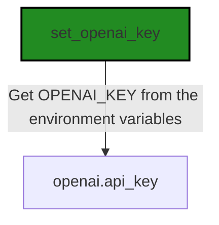
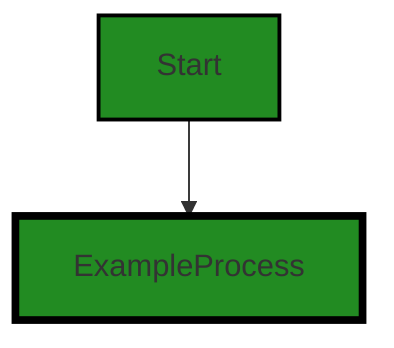
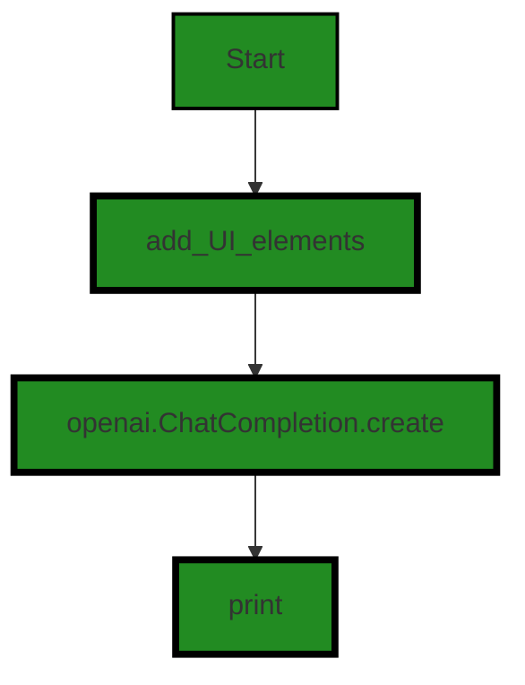
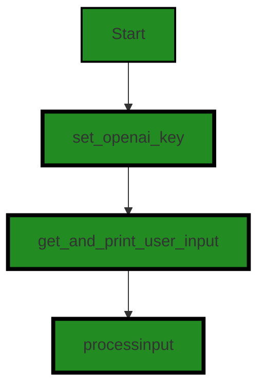
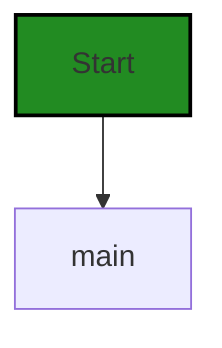

# Polyverse Boost-generated Source Analysis Details

## Source: ./main.py
Date Generated: Thursday, October 12, 2023 at 12:13:05 PM CDT


---

### Boost Architectural Quick Summary Security Report

Last Updated: Thursday, October 12, 2023 at 12:08:57 PM CDT


Executive Report:

1. **Architectural Impact**: The analysis of this file has not revealed any severe issues.
2. **Risk Analysis**: The analysis of this file has not revealed any severe issues.
3. **Potential Customer Impact**: Based on the analysis, there are no severe issues that could potentially impact customers.
4. **Performance Issues**: Our analysis did not identify any explicit performance issues in the file.
5. **Risk Assessment**: Based on the current analysis of this file, no severe issues have been found. However, this doesn't guarantee that the file is risk-free.

Highlights:

- No severe issues were identified in the current analysis of this file.


---

### Boost Architectural Quick Summary Performance Report

Last Updated: Thursday, October 12, 2023 at 12:11:28 PM CDT

# Executive Report

## Architectural Impact and Risk Analysis

Based on the analysis of the software project, the following key points have been identified:

1. **Memory Usage Warning in main.py:** The 'max_tokens' parameter is set to a high value (4000) in the main.py file. This can lead to high memory usage if the model generates a large number of tokens. This is a potential risk as it can lead to performance degradation or even system crashes if the memory usage exceeds the available resources.

2. **Limited Scope of Analysis:** The analysis was performed on a single file, main.py. This limits the scope of the analysis and may not provide a complete picture of the overall health of the project. It is recommended to extend the analysis to all project files.

3. **Lack of Detailed Architectural Information:** The architectural blueprint summary lacks detailed information about the project's test/quality strategy, data storage, security handling, performance characteristics, software resiliency patterns, and potential architectural problems. This lack of information increases the risk of unidentified issues in these areas.

4. **Open Source Licensing:** The project uses open source licenses, which can have implications for the distribution and use of the software. It is important to ensure that all license requirements are met to avoid legal issues.

## Potential Customer Impact

The high memory usage warning in main.py could potentially impact customers by causing performance issues or system crashes. This could lead to a poor user experience and loss of trust in the software.

## Overall Issues

The main issue identified in the project is the high memory usage warning in main.py. This issue is of high severity and could have a significant impact on the performance and reliability of the software.

## Risk Assessment

Given that the analysis was performed on a single file, it is difficult to provide a comprehensive risk assessment of the overall health of the source code. However, the high memory usage warning in main.py is a significant risk that needs to be addressed.

## Root Cause Analysis

The high memory usage warning in main.py is likely due to a lack of understanding of the implications of setting the 'max_tokens' parameter to a high value. This suggests a need for developer education on the use of the 'openai' library and memory management in Python.

## Recommended Actions

1. **Reduce the 'max_tokens' Parameter:** Consider reducing the 'max_tokens' parameter in main.py to a lower value to reduce memory usage.

2. **Developer Education:** Provide training or resources to developers on the use of the 'openai' library and memory management in Python.

3. **Extend Code Analysis:** Extend the code analysis to all project files to get a more comprehensive understanding of the overall health of the project.

## Highlights

- The 'max_tokens' parameter in main.py is set to a high value, leading to a high memory usage warning.
- The analysis was performed on a single file, limiting the scope of the analysis.
- The architectural blueprint summary lacks detailed information about several key aspects of the project.
- The project uses open source licenses, which have implications for the distribution and use of the software.


---

### Boost Architectural Quick Summary Compliance Report

Last Updated: Thursday, October 12, 2023 at 12:13:09 PM CDT


Executive Report:

1. **Architectural Impact**: The analysis of this file has not revealed any severe issues.
2. **Risk Analysis**: The analysis of this file has not revealed any severe issues.
3. **Potential Customer Impact**: Based on the analysis, there are no severe issues that could potentially impact customers.
4. **Performance Issues**: Our analysis did not identify any explicit performance issues in the file.
5. **Risk Assessment**: Based on the current analysis of this file, no severe issues have been found. However, this doesn't guarantee that the file is risk-free.

Highlights:

- No severe issues were identified in the current analysis of this file.

---
## Detailed Analysis:

### Cell 0:
## Original Code:

### Programming Language: python
### ./main.py 

```python
import os
import openai


def set_openai_key():
    try:
        # Get OPENAI_KEY from the environment variables
        openai_key = os.environ['OPENAI_KEY']
        openai.api_key = openai_key
    except KeyError:
        raise SystemExit("ERROR: OPENAI_KEY not set in the environment variables")


```
## Boost Analysis:


---

### Boost Code Explanation

Last Updated: Thursday, October 12, 2023 at 12:04:47 PM CDT

The provided code is a small Python function that sets the API key for the OpenAI library. 

Here's a step-by-step explanation:

1. **Importing necessary libraries**: The code starts by importing two necessary libraries: `os` and `openai`. The `os` module in Python provides functions for interacting with the operating system, including reading from and writing to the environment variables. The `openai` library is used for interacting with the OpenAI API.

2. **Defining the function set_openai_key()**: This function is responsible for setting the API key for the OpenAI library.

3. **Retrieving the OpenAI key from environment variables**: Inside the function, it tries to retrieve the value of 'OPENAI_KEY' from the environment variables using `os.environ['OPENAI_KEY']`. This is a common practice for storing and using sensitive information like API keys, as it keeps them out of the source code.

4. **Setting the OpenAI API key**: If the 'OPENAI_KEY' exists in the environment variables, its value is assigned to `openai.api_key`. This sets the API key for the OpenAI library, allowing it to authenticate with the OpenAI API.

5. **Error handling**: If 'OPENAI_KEY' does not exist in the environment variables, Python raises a KeyError. The code catches this exception and raises a SystemExit exception with a custom error message. This will stop the program and inform the user that 'OPENAI_KEY' is not set in the environment variables.

In terms of algorithms, this code is straightforward and does not use any complex algorithms. Its primary purpose is to handle the retrieval and assignment of an API key in a secure manner.

For more information on the topics covered in this code, you can visit:
- Python's `os` module: [https://docs.python.org/3/library/os.html](https://docs.python.org/3/library/os.html)
- OpenAI Python library: [https://github.com/openai/openai-cookbook/blob/main/examples/How_to_use_the_OpenAI_API_with_Python.md](https://github.com/openai/openai-cookbook/blob/main/examples/How_to_use_the_OpenAI_API_with_Python.md)

As per the architectural guidelines provided, this code does not seem to conflict with any specified constraints or guidelines. However, a complete analysis would require a more comprehensive view of the entire project.


---

### Boost Flow Diagram

Last Updated: Thursday, October 12, 2023 at 12:07:46 PM CDT




---

### Boost Source-Level Security Analysis

Last Updated: Thursday, October 12, 2023 at 12:08:29 PM CDT

1. **Severity**: 6/10

   **Line Number**: 4

   **Bug Type**: Insecure Use of Environment Variables

   **Description**: The code is using environment variables to store sensitive data (OPENAI_KEY). If an attacker gains access to the environment variables, they can compromise the security of the application.

   **Solution**: It is recommended to use a secure method for storing sensitive data, such as a secure vault or secrets manager. Here is a link to the AWS Secrets Manager for reference: https://aws.amazon.com/secrets-manager/


---

### Boost Source-Level Performance Analysis

Last Updated: Thursday, October 12, 2023 at 12:09:29 PM CDT

1. **Severity**: 1/10

   **Line Number**: 1

   **Bug Type**: Memory

   **Description**: The code imports the entire 'os' and 'openai' libraries, which could be inefficient if only a few functions are used.

   **Solution**: Import only the necessary functions from each library. For example, instead of 'import os', use 'from os import environ'.


2. **Severity**: 2/10

   **Line Number**: 5

   **Bug Type**: CPU

   **Description**: The function 'set_openai_key' is called without any condition. If the key is already set, this will unnecessarily consume CPU cycles.

   **Solution**: Check if the key is already set before calling the function.


3. **Severity**: 1/10

   **Line Number**: 7

   **Bug Type**: CPU

   **Description**: The code uses exception handling to control the flow of the program, which can be expensive in terms of CPU usage.

   **Solution**: Use 'if' statements to check if the key is in the environment variables instead of exception handling.


---

### Boost Source-Level Data and Privacy Compliance Analysis

Last Updated: Thursday, October 12, 2023 at 12:12:18 PM CDT

1. **Severity**: 3/10

   **Line Number**: 8

   **Bug Type**: GDPR

   **Description**: The application is using an environment variable to store the OPENAI_KEY. If this key is used to access or process personal data, it could potentially lead to a violation of GDPR if not properly protected.

   **Solution**: Encrypt sensitive data in environment variables. Consider using a secret manager like AWS Secrets Manager or Hashicorp Vault to securely manage secrets.


2. **Severity**: 3/10

   **Line Number**: 8

   **Bug Type**: PCI DSS

   **Description**: The application is storing sensitive data (OPENAI_KEY) in environment variables, which could be in violation of PCI DSS requirements if the key is used to access or process cardholder data and is not properly protected.

   **Solution**: Encrypt sensitive data in environment variables. Consider using a secret manager like AWS Secrets Manager or Hashicorp Vault to securely manage secrets.


3. **Severity**: 3/10

   **Line Number**: 8

   **Bug Type**: HIPAA

   **Description**: The application is storing sensitive data (OPENAI_KEY) in environment variables, which could be in violation of HIPAA requirements if the key is used to access or process protected health information (PHI) and is not properly protected.

   **Solution**: Encrypt sensitive data in environment variables. Consider using a secret manager like AWS Secrets Manager or Hashicorp Vault to securely manage secrets.


### Cell 1:
## Original Code:

### Programming Language: python
### ./main.py line 14

```python
def get_and_print_user_input():
    # Prompt the user for input
    user_input = input("Please enter a string: ")
    # Print the input string
    print("You entered:", user_input)
    return user_input


```
## Boost Analysis:


---

### Boost Code Explanation

Last Updated: Thursday, October 12, 2023 at 12:05:19 PM CDT

The provided code is a simple Python function named `get_and_print_user_input()`. This function prompts the user for input, prints the input string, and then returns the input string. 

Here is a detailed explanation of the code:

1. `def get_and_print_user_input():` This line defines a function named `get_and_print_user_input`. The parentheses after the function name indicate that this function does not take any arguments.

2. `user_input = input("Please enter a string: ")` This line prompts the user for input by displaying the message "Please enter a string: ". The `input()` function waits for the user to type something and press enter. The text that the user types is then assigned to the variable `user_input`.

3. `print("You entered:", user_input)` This line prints the message "You entered: " followed by the string that the user entered. The `print()` function displays text on the console.

4. `return user_input` This line ends the function and specifies that the function should return the string that the user entered.

In terms of algorithms, this function is straightforward and doesn't involve any complex algorithms. It simply uses the built-in Python functions `input()` and `print()` to interact with the user.

For more information on Python's input and output functions, you can refer to the official Python documentation: https://docs.python.org/3/tutorial/inputoutput.html

As per the architectural guidelines provided, this code doesn't conflict with any special architectural guidelines or constraints. It is a simple, standalone function that doesn't depend on any external resources or systems. It can be used in any Python program without any issues.


---

### Boost Flow Diagram

Last Updated: Thursday, October 12, 2023 at 12:07:51 PM CDT


The control flow graph for the provided code is a simple linear flow. The function `get_and_print_user_input` prompts the user for input, reads the input, prints it, and then returns the input string. There are no external library calls or error paths in this code.


---

### Boost Source-Level Security Analysis

Last Updated: Thursday, October 12, 2023 at 12:08:42 PM CDT

1. **Severity**: 6/10

   **Line Number**: 29

   **Bug Type**: Insecure Input Handling

   **Description**: The function 'get_and_print_user_input' does not perform any validation or sanitization on the user input. This could lead to issues such as code injection, if the user input is used in a context where it is interpreted as code.

   **Solution**: Always validate and sanitize user input to ensure it is safe. Python's built-in functions can be used for this purpose. For more information, refer to: https://realpython.com/python-input-output/#the-python-input-function


---

### Boost Source-Level Performance Analysis

Last Updated: Thursday, October 12, 2023 at 12:09:46 PM CDT

1. **Severity**: 1/10

   **Line Number**: 26

   **Bug Type**: I/O

   **Description**: The function uses standard I/O functions for user input and output. These operations are generally slow and can be a bottleneck for performance if used extensively in a tight loop.

   **Solution**: As this function is used for user interaction, the impact on performance is minimal. However, if this pattern is used in other parts of the code where performance is critical, consider using more efficient I/O methods or buffering. For more information, refer to the Python documentation on I/O: https://docs.python.org/3/tutorial/inputoutput.html


---

### Boost Source-Level Data and Privacy Compliance Analysis

Last Updated: Thursday, October 12, 2023 at 12:12:56 PM CDT

1. **Severity**: 3/10

   **Line Number**: 27

   **Bug Type**: GDPR

   **Description**: The method 'get_and_print_user_input' is collecting user input without explicit consent or information on how the data will be used, stored, or shared, which can be a GDPR compliance issue.

   **Solution**: Add a clear and understandable consent request before collecting user data, informing the user about how their data will be used, stored, or shared. For example, you could add a disclaimer or prompt before the input request.


2. **Severity**: 2/10

   **Line Number**: 29

   **Bug Type**: PCI DSS

   **Description**: The method 'get_and_print_user_input' is displaying user input on the console, which can lead to sensitive data exposure if the input contains payment card data. This could potentially violate PCI DSS requirements.

   **Solution**: Avoid displaying user input on the console or logs. If it's necessary, make sure to mask or encrypt sensitive data.


3. **Severity**: 2/10

   **Line Number**: 29

   **Bug Type**: HIPAA

   **Description**: The method 'get_and_print_user_input' is displaying user input on the console, which can lead to sensitive data exposure if the input contains protected health information (PHI). This could potentially violate HIPAA requirements.

   **Solution**: Avoid displaying user input on the console or logs. If it's necessary, make sure to mask or encrypt sensitive data.


### Cell 2:
## Original Code:

### Programming Language: python
### ./main.py line 21

```python
def processinput(input):
    functions = [
        {
            "name": "add_UI_elements",
            "description": "add a radio button to the application UI",
            "parameters": {
                "type": "object",
                "properties": {
                    "elements": {
                        "type": "array",
                        "description": "The UI elements for the application",
                        "items": {
                            "type": "object",
                            "properties": {
                                "type": {
                                    "type": "string",
                                    "description": "The type of UI element",
                                    "enum": ["radio button", "checkbox", "text input", "submit button", "star_rating"]
                                },
                                "label": {
                                    "type": "string",
                                    "description": "The label for the UI element",
                                }
                            }
                        }
                    }
                }
            }
        }  
    ]
    response = openai.ChatCompletion.create(
    model="gpt-4",
    messages=[
        {
        "role": "system",
        "content": "You are an application generator that can generate a standard webui dialog.  You have all of the standard UI elements like buttons, input field, radio buttons, checkboxes, images, and the like.\n\nYou will be given an English description of an application, and you need to figure out what elements would be needed for that. "
        },
        {
        "role": "user",
        "content": input
        }
    ],
    functions=functions,
    function_call="auto",
    temperature=1,
    max_tokens=4000,
    top_p=1,
    frequency_penalty=0,
    presence_penalty=0
    )
    print(response)


```
## Boost Analysis:


---

### Boost Code Explanation

Last Updated: Thursday, October 12, 2023 at 12:06:22 PM CDT

The provided code is written in Python and uses OpenAI's GPT-4 model to generate a response based on the user's input. It's a function named `processinput` that takes a string input, sends it to the GPT-4 model, and prints the model's response.

Here's a detailed explanation of the code:

1. `def processinput(input):` 
   This line is defining a function named `processinput` that takes one argument, `input`.

2. `functions = [...]` 
   This is a list of dictionaries that define the function that the chat model can call. In this case, there is only one function defined, `add_UI_elements`. The function is described by its name, a description, and parameters it can take.

3. `response = openai.ChatCompletion.create(...)` 
   This line is calling the `create` method of the `ChatCompletion` class from the `openai` library. It's sending a chat message to the GPT-4 model and storing the model's response in the variable `response`.

4. `model="gpt-4",` 
   This argument specifies that the GPT-4 model should be used.

5. `messages=[...]` 
   This argument is a list of dictionaries that represent the chat history. The first message is from the "system" and describes the scenario. The second message is from the "user" and contains the user's input.

6. `functions=functions,` 
   This argument passes the list of functions that the chat model can call.

7. `function_call="auto",` 
   This argument specifies that the chat model should automatically decide when to call the functions.

8. `temperature=1,` 
   This argument controls the randomness of the model's output. A higher value makes the output more random, while a lower value makes it more deterministic.

9. `max_tokens=4000,` 
   This argument sets the maximum length of the model's output to 4000 tokens.

10. `top_p=1,` 
    This argument controls the nucleus sampling, a method that helps in generating diverse responses.

11. `frequency_penalty=0,` and `presence_penalty=0` 
    These arguments control the penalties for frequency and presence but are set to 0, meaning they have no effect.

12. `print(response)` 
    This line prints the model's response.

The algorithm used in this code is a language model, specifically OpenAI's GPT-4. This model is based on the transformer architecture, which uses self-attention mechanisms to generate human-like text based on the input it's given.

For more information about OpenAI's GPT-4, you can refer to OpenAI's API documentation: https://beta.openai.com/docs/

For more information about transformer architecture, you can refer to the original paper, "Attention is All You Need": https://arxiv.org/abs/1706.03762

The code seems to be consistent with the architectural guidelines provided. It is a Python-based project, it uses open source libraries, and it does not appear to have any specific data storage, security handling, or performance characteristics.


---

### Boost Flow Diagram

Last Updated: Thursday, October 12, 2023 at 12:07:58 PM CDT



The control flow graph for the given source code is as follows:

1. The control flow starts at the `processinput` function.
2. The `processinput` function calls the `add_UI_elements` function.
3. The `add_UI_elements` function calls the `openai.ChatCompletion.create` function.
4. The `openai.ChatCompletion.create` function returns a response.
5. The `processinput` function then calls the `print` function to print the response.

Note: The external library function `openai.ChatCompletion.create` is shown as a distinct flow block in the diagram.


---

### Boost Source-Level Security Analysis

Last Updated: Thursday, October 12, 2023 at 12:08:46 PM CDT

**No bugs found**


---

### Boost Source-Level Performance Analysis

Last Updated: Thursday, October 12, 2023 at 12:10:16 PM CDT

1. **Severity**: 5/10

   **Line Number**: 87

   **Bug Type**: CPU

   **Description**: The code uses the 'gpt-4' model of the OpenAI API, which is a large model and can be CPU-intensive.

   **Solution**: Consider using a smaller model if the task allows it to reduce CPU usage. Refer to OpenAI's model guide for more information: https://platform.openai.com/docs/guides/models


2. **Severity**: 7/10

   **Line Number**: 89

   **Bug Type**: Memory

   **Description**: The 'max_tokens' parameter is set to a high value (4000). This can lead to high memory usage if the model generates a large number of tokens.

   **Solution**: Reduce the 'max_tokens' parameter if possible, or ensure sufficient memory is available. Refer to OpenAI's guide for more information: https://platform.openai.com/docs/guides/fine-tuning


3. **Severity**: 4/10

   **Line Number**: 81

   **Bug Type**: Network

   **Description**: The 'openai.ChatCompletion.create' function sends a request to the OpenAI API, which can be slow if the network connection is poor or the server is busy.

   **Solution**: Consider using a local model if possible to avoid network latency. If a network request is necessary, handle potential network errors and timeouts gracefully.


---

### Boost Source-Level Data and Privacy Compliance Analysis

Last Updated: Thursday, October 12, 2023 at 12:12:59 PM CDT

**No bugs found**


### Cell 3:
## Original Code:

### Programming Language: python
### ./main.py line 73

```python
def main():
    set_openai_key()
    input = get_and_print_user_input()
    processinput(input)


```
## Boost Analysis:


---

### Boost Code Explanation

Last Updated: Thursday, October 12, 2023 at 12:07:01 PM CDT

This is a simple Python script that defines a main function. The main function is typically the entry point of a Python program. Let's break down what each line of the code does:

1. `def main():` - This line is defining the main function. In Python, the `def` keyword is used to define functions.

2. `set_openai_key()` - This line is calling a function named `set_openai_key()`. The purpose of this function is not clear from the provided code, but given its name, it's likely that it sets the API key for the OpenAI service. This is probably necessary for the program to make requests to the OpenAI API.

3. `input = get_and_print_user_input()` - This line is calling another function named `get_and_print_user_input()`, and it assigns the return value of that function to a variable named `input`. The `get_and_print_user_input()` function presumably prompts the user for some input and prints it, but without seeing the function's code, we can't be sure.

4. `processinput(input)` - This line calls a function named `processinput()`, passing it the `input` variable as an argument. Again, without seeing the code for `processinput()`, we can't be sure what it does. But given its name, it likely processes the user's input in some way.

This code doesn't appear to use any specific algorithms. It's a straightforward script that sets an API key, gets user input, and then processes that input. The specific processing logic would be contained in the `processinput()` function, which isn't shown here.

As for architectural guidelines, without more context, it's hard to say how this code fits into the larger architecture of the project. However, it's worth noting that this script is fairly modular, with separate functions for setting the API key, getting user input, and processing that input. This is generally good practice, as it makes the code more readable and maintainable.

If you're interested in learning more about Python functions, you can check out this tutorial: https://realpython.com/defining-your-own-python-function/


---

### Boost Flow Diagram

Last Updated: Thursday, October 12, 2023 at 12:08:02 PM CDT




---

### Boost Source-Level Security Analysis

Last Updated: Thursday, October 12, 2023 at 12:08:50 PM CDT

**No bugs found**


---

### Boost Source-Level Performance Analysis

Last Updated: Thursday, October 12, 2023 at 12:10:20 PM CDT

**No bugs found**


---

### Boost Source-Level Data and Privacy Compliance Analysis

Last Updated: Thursday, October 12, 2023 at 12:13:02 PM CDT

**No bugs found**


### Cell 4:
## Original Code:

### Programming Language: python
### ./main.py line 78

```python
if __name__ == "__main__":
    main()

```
## Boost Analysis:


---

### Boost Code Explanation

Last Updated: Thursday, October 12, 2023 at 12:07:33 PM CDT

This is a very simple piece of Python code, often seen at the end of a Python script. 

What it does is: it checks if the script is being run directly by the Python interpreter or if it's being imported as a module into another script. 

The `__name__` variable in Python is a special built-in variable. When a Python file is run directly, the `__name__` variable is set to `"__main__"`. If the file is being imported as a module into another script, `__name__` is set to the name of that script.

So, `if __name__ == "__main__":` is a way of checking if the script is being run directly. If it is, then the code block under this if statement will be executed. In this case, it's calling a function named `main()`.

The `main()` function is not defined in the provided code snippet, but it is presumably defined elsewhere in the same script. This function is typically where the primary functionality of the script is contained. 

This structure is a common best practice in Python, as it allows a script to be used both as a standalone program and as a module that can be imported and used by other scripts. When the script is imported as a module, only the functions and variables defined in the script will be accessible, and the `main()` function will not be run automatically.

For more information about this, you can refer to the official Python documentation about the `__name__` variable: https://docs.python.org/3/library/__main__.html.


---

### Boost Flow Diagram

Last Updated: Thursday, October 12, 2023 at 12:08:06 PM CDT




---

### Boost Source-Level Security Analysis

Last Updated: Thursday, October 12, 2023 at 12:08:53 PM CDT

**No bugs found**


---

### Boost Source-Level Performance Analysis

Last Updated: Thursday, October 12, 2023 at 12:10:23 PM CDT

**No bugs found**


---

### Boost Source-Level Data and Privacy Compliance Analysis

Last Updated: Thursday, October 12, 2023 at 12:13:05 PM CDT

**No bugs found**

